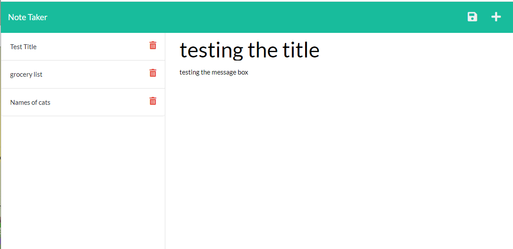
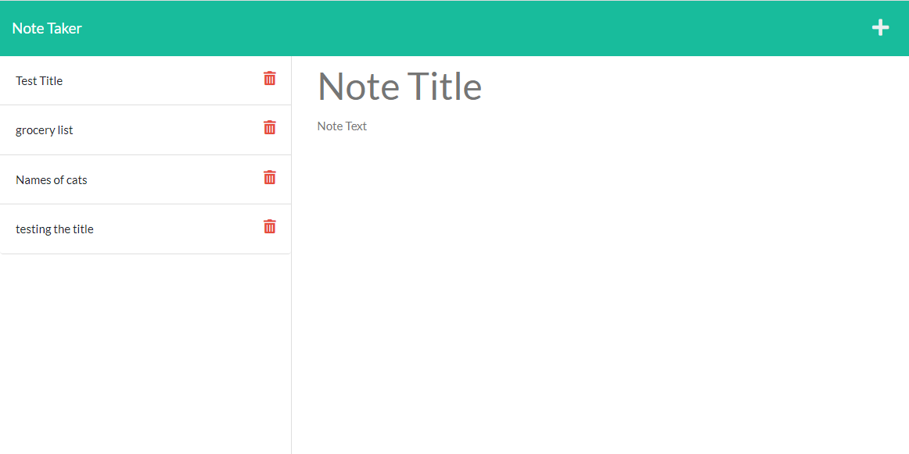
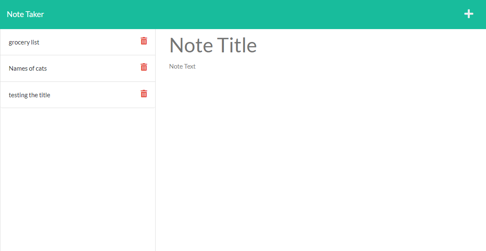

 

# Unit 11 Homework: Note Taker

## [Description](#description)

In this homework I used Express.js to save and retrieve note data from a JSON file. 

When the aplication loads, there is a button that links to the notes page. On the notes page, the left side displays existing notes. On the right side of the applicaion there is an empty field to enter a new note title and text. On the top right side there is a save button. Once the information for the new note is filled out, the user can click on the save button and the new note will populate on the left side column with the rest if the old notes. If the user wants to create a new note, there is  a + button at the top right side to create a new note. When the user clicks any of the old notes, the old note will open. if the user wants to delete the note, there is a belete button on each note.

To deploy the application, I am using Heroku. Here is the Link to the deployment of the [application](https://shrouded-eyrie-81862.herokuapp.com/).

## Table of Content

* [Description](#description)
* [Installation](#installation)
* [Test](#test)
* [Usage](#usage)
* [License](#license)
* [Contributing](#contributing)
* [Questions](#questions)

## [Installation](#installation)
To initialie, run the following command.

    node server.js

## [Test](#test)
To run tests, run the following command

    none, no tests are provided at this moment.

## [Usage](#usage)

This application lets the user write, save and delete notes. 

## Screenshot of Readme generator:

## [License](#license)

## [Contributing](#contributing)

none

## [Questions](#questions)

If you have any questions about the repo, or would like to contact me directly, 
here is my email: maribel.montes4@gmail.com. You can find more of my work at [Maribel Montes](https://github.com/MaryMD98).

